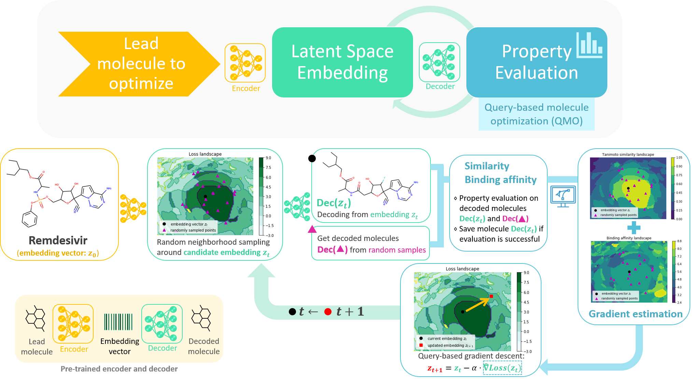

# Query-based Molecule Optimization (QMO)

Source code for "Optimizing Molecules using Efficient Queries from Property Evaluations," to be published in Nature Machine Intelligence.

> Machine learning based methods have shown potential for optimizing existing molecules with more desirable properties, a critical step towards accelerating new chemical discovery. Here we propose **QMO**, a generic query-based molecule optimization framework that exploits latent embeddings from a molecule autoencoder. QMO improves the desired properties of an input molecule based on efficient queries, guided by a set of molecular property predictions and evaluation metrics.



## Installation

A CUDA-capable GPU is required.

Install the conda environment with:

```
conda env create -f environment.yml
conda activate qmo
```

Download the pre-trained CDDD model using the bash script:

```
./download_default_model.sh
```

## Instructions for running experiments

The two shellscripts will automatically run the experiments. **Running in parallel on a compute cluster is recommended.** Otherwise, individual molecules can be run for spot checking. These will run sequentially for all molecules in the respective dataset. That means the logP experiment will take up to ~23 hrs total for all 800 molecules and the QED experiment up to ~30 hrs total if the jobs cannot be distributed in parallel.

Explanations of the various running parameters can be found using:

```sh
python QMO/run.py --help
```

Note: for the two benchmark tasks, the weight multiplies the distance loss
instead of the property score, as in Equation 2. This is functionally
equivalent but the hyperparameters should be converted by using the reciprocal
of the `weight` and dividing the `base_lr` by the new weight and the `--flip-weight` flag should be used (this is already handled in the shellscripts).

Individual starting sequences for each experiment can be run like so:

logP:
```sh
python QMO/run.py -t=80 -k=1 -w=25 --beta=10 -q=100 --base_lr=0.1 --adam --flip-weight -s=123456789 --sim=0.4 --score=logP $seq
```

QED:
```sh
python QMO/run.py -t=20 -k=50 -w=0.25 --beta=10 -q=50 --base_lr=0.2 --adam --flip-weight -s=123456789 --early-stop=0.9 --sim=0.4 --score=qed $seq
```

## Description of outputs

Results are saved to the `results/` directory according to the SMILES string of the input. The optimized SMILES can be accessed via:

```py
np.load('path/to/result.npz')['seq']
```

Results for the QED benchmark task can be verified simply by computing the number of successful jobs out of 800. Because of randomness, this may differ slightly from the exact number in the paper.

Results for the penalized logP benchmark task can be verified using the following snippet:

```py
import os
import numpy as np
import pandas as pd
from rdkit import Chem

from QMO.losses import penalized_logP

logp = pd.read_csv('data/logp_test.csv', sep=' ', header=None, usecols=[0], squeeze=True)
improvement = []

for s in logp:
    res = np.load(f'results/{s}/max_iter=80~num_restarts=1~weight=25.0~beta=10.0~num_grad_samples=100~base_lr=0.1~adam=True~early_stop=False~seed=123456789~score=logP~qed=None~logP=None~sim=0.4~aff=None.npz')
    improvement.append(res['pen_logP'] - penalized_logP(Chem.MolFromSmiles(s)))

print(np.mean(improvement), np.std(improvement))
```

This is for the sim=0.4 case.

TensorBoard logs can be viewed with:

```sh
tensorboard --logdir runs
```

Various statistics are also printed to stdout during training. These can be
saved to a file with either output redirection (`>`) or `| tee`.

## Citation

If you use this work, please cite the following:
```
@misc{hoffman2020optimizing,
      title={Optimizing Molecules using Efficient Queries from Property Evaluations},
      author={Samuel Hoffman and Vijil Chenthamarakshan and Kahini Wadhawan and Pin-Yu Chen and Payel Das},
      year={2020},
      eprint={2011.01921},
      archivePrefix={arXiv},
      primaryClass={cs.LG}
}
```
